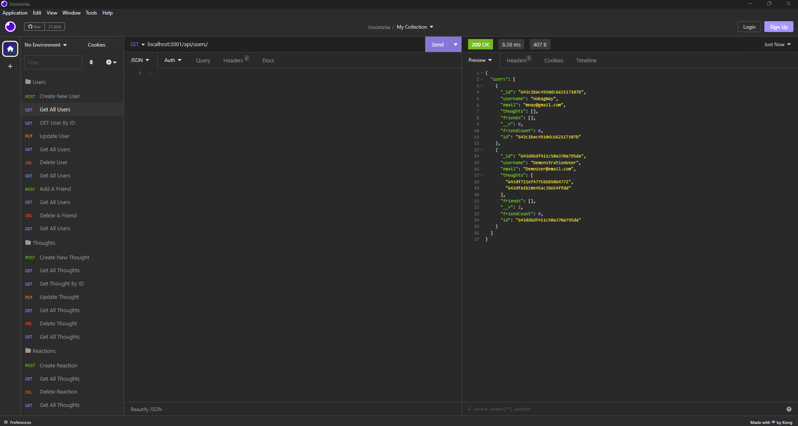

# Tech Blog

## Module-14 Model-View-Controller:
```md
An API for a social network web application where users can share their thoughts, react to friends’ thoughts, and create a friend list. 
```

## Table of Contents

 * [User Story](#user-story)
 * [Acceptance Criteria](#acceptance-criteria)
 * [Installation](#installation)
 * [Application Demonstration](#application-demonstration)
 * [Live Application](#Live-Application)

## User Story

```md
AS A social media startup
I WANT an API for my social network that uses a NoSQL database
SO THAT my website can handle large amounts of unstructured data
```

## Acceptance Criteria

```md
GIVEN a social network API
WHEN I enter the command to invoke the application
THEN my server is started and the Mongoose models are synced to the MongoDB database
WHEN I open API GET routes in Insomnia for users and thoughts
THEN the data for each of these routes is displayed in a formatted JSON
WHEN I test API POST, PUT, and DELETE routes in Insomnia
THEN I am able to successfully create, update, and delete users and thoughts in my database
WHEN I test API POST and DELETE routes in Insomnia
THEN I am able to successfully create and delete reactions to thoughts and add and remove friends to a user’s friend list
```
## Installation

```md
Right click on the server.js file and click "Open in integrated terminal" 
type "npm i" to install dependencies
type "npm start" to start the server
Complete the rest on Insomnia or Postman
```

## Application Demonstration



## Live Application